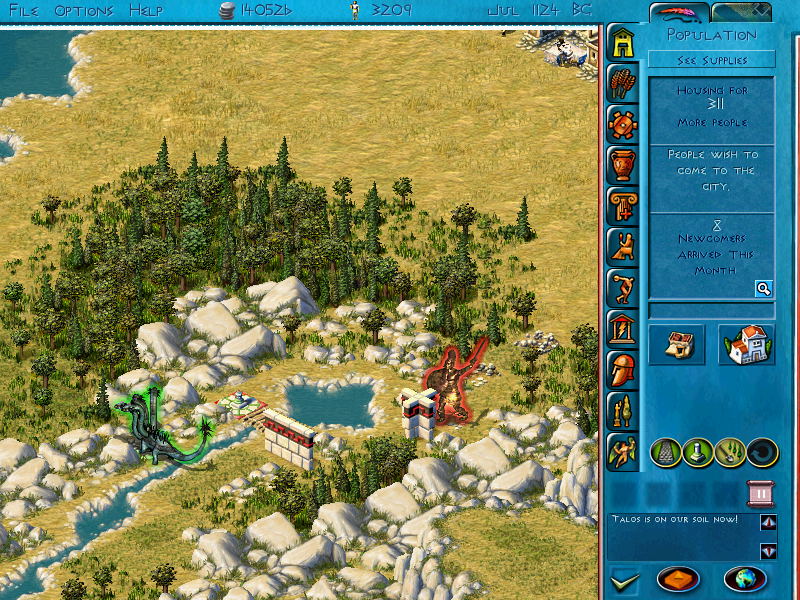

Sir Walrus' Occasionally Unethical Advice  
Master of Olympus - Zeus and Master of Atlantis - Poseidon

General
=======

Disasters
---------

Earthquake, lava, flood. They suck.

What if you could remove them? There are a few game bugs that allow you to.

- You can build roads over earthquakes. If you build a roadblock over that road, then remove both, the earthquake tile is gone. Unfortunately, this only works if you can build a road there (clustered cracks, and the last tile, are untouchable), and the glitch is fixed if Master of Atlantis is installed.
- Build one tile of road immediately before the disaster starts (after the disaster message is fine; pausing is fine). Let some disaster tiles appear and use the Undo button, and the disaster tiles will be reverted to empty land. Using this glitch multiple times will allow undoing the entire disaster (pausing or game speed adjustment required), whether it's earthquake, lava, or flood (you can also make a tidal wave permanent, though it's likely to go away next time that area floods); however, affected buildings will remain demolished. A Water Crossing or Sanctuary demolished by a subsequently-undone disaster will turn into glitched tiles; you may want to delete them before the disaster hits, or simply not build them there. You can't undo a Landslide this way, you'll just get glitched tiles if you try; luckily, landslides are very rare, there's only one single landslide across the 14 adventures in the game (including colonies, but excluding open play).

Monsters
--------

are as destructive as disasters, rendering parts of your landscape unusable. And, like disasters, most of them can be completely defanged with some simple construction work.

Find an island you don't need; ideally 1x1 near the monster, but others can work. Build a short Water Crossing to it (1 or 2 tiles - if the next target is too distant, the monster will get bored and go home). Build a line of walls from the monster to the island, and a roadblock on the island. Wait for the monster to follow the bait onto the island. While it's busy destroying the roadblock, remove the bridge.

The monster is now harmlessly stuck on the island, scaring your nearby walkers if right clicked and doing nothing else; it won't even shoot. If you have an episode goal to kill it, you can focus on the hero and ignore the monster; if not, you can leave it alone as long as you wish.

Of course, not all monsters can be trapped. Some cities don't have any suitable trap islands, some don't have Water Crossings, and Kraken and Scylla don't care about your bridges.

Residental district shape
-------------------------

is a question with many possible answers. The following is my preference, but there's no right or wrong, as long as it works.

For common housing, I usually build nine or ten Fish Ponds in a row, surround them with houses on three sides, road around that, Podium/Theater and College/Drama School on opposite ends of the road (so they pass the entire district - the resulting roamers can safely be ignored), the Agora at the short side, and a roadblocked road to Granary/etc beside the Agora. Tax Office, Gymnasium, etc are placed outside the peddler's range, or instead of houses; Gymnasium usually goes at the road's corner, so it takes less space. Additional Fish Ponds go behind the houses. Such a district will house around 5000 citizens, and food distribution may be difficult unless your Granary is near your food production. Building more Granaries won't help - the bottleneck is the Agora's food vendor.

For elite housing, I start with a 89 tiles long straight road (178 drachma). The outer 40 tiles on each end are Boulevard; the middle contains roads to both sides (sometimes one road is omitted, for space reasons), a Grand Agora, and Tax Office and Maintenance Office. Beyond the end of the road, I place Gymnasium, and additional Tax Office and Maintenance Office (usually on a road to the side, for space reasons). The Gymnasium can't reach the innermost four houses; this is solved by placing more Gymnasiums on the side roads by the Agora (sometimes without a Maintenance Office - on Beginner difficulty, Gymnasium is one of few buildings that can neither collapse nor catch fire). I omit the Infirmary - it'll make the game say hygiene isn't perfect, but it has no real consequences. Like common housing, I put Fish Ponds behind the houses, culture behind the road end roadblocks, and I ignore the roaming culture walkers. This allows one Agora to cover 40 elite houses, neatly filling the palace.

The above can, of course, be reduced, in case of space constraints; most cities can't fit the elite housing's 89x19 rectangle (plus the culture at the end), and even the common district's 41x22 won't always fit, especially in colonies. I often remove a few appeal buildings, and sometimes shorten the districts.

In Atlantis, I replace the elite district's middle Maintenance Office with Bibliotheke (or, on the easiest difficulty, I simply omit the Bibliotheke - as long as the Museum is functional, they'll reach Estate even without scholar access). I also replace every Fish Pond with Stone Circle; they are, by far, the most powerful, though their range is shorter than Fish Pond and Baths.

Invading gods
-------------

will destroy a building or two, and curse a building or two, before leaving.

If you're unlucky, the god will destroy a storehouse full of valuable items. If you delete it, then immediately undo, the god will pick something else to destroy, without damaging your goods. Repeat a few times, and the god leaves. (Only works for destruction, not curses - gods cannot be dissuaded from cursing anything. The same trick works for monsters, though they'll need to be constantly watched.)

An even more effective way to get the god to go away is to place a Hero's Hall near the god's appearance point. While the game will say the god wins, it will also make the god feel it's done enough damage, and switch to look for something curseable. (Other effects, such as Hermes' and Poseidon's trade disruption, will still happen.) Some heroes require various buildings near them, but once they're summoned in an episode, you can remove the Hall, place it somewhere else, and resummon the hero as much as you want.

Income goals
------------

are often easiest accomplished by requesting drachmas from an ally, then waiting for next year, before starting to build your city. Only works if you don't have a city yet, but this trick does make many colony episodes easier. (If you have a city, you usually have a solid income too.)

Unethically sourced money
-------------------------

The most predictable and scalable way to gain money is taxes. The most predictable way to lose a lot of money is wages.

Wouldn't it be nice if you got more from taxes than you lose to wages? This is perfectly possible, at least on lower difficulties.

Elite housing pays a lot more taxes than common, but that's ethical and uninteresting.

You can also leave a significant fraction of your population unemployed, adjust wages or taxes, or hire them as rabble/archers, but this affects popularity if done for too long.

A few things that don't affect popularity are building more Fish Ponds and Monuments (housing in high-appeal areas pay more taxes), upgrading them (Homestead pays twice as much taxes per citizen as Hovel - if you get too many employees, just remove some houses), and building and manning more Trireme Wharfs and Towers (they don't count as employees - they don't claim wages).

Of course, the most ethical unethically sourced money is to raid an ally (Greece only), but if you have a military, you have the elite houses' tax money already.

Fountains
---------

have annoyingly short range, and sometimes choose to walk in the same direction thrice in a row while your houses devolve.

The latter is due to a game glitch. Most walkers start walking in the same direction they returned last time, but returning Water Bearers sometimes aim for a different tile than they'll return to, confusing the direction tracking. More specifically, if the tile straight north of the Fountain is a road, the Bearers will return to there, but they can only appear on the eight directly adjacent tiles. To avoid this, put the Fountain north of the road; if its northern tile is not road, the start and destination will be the same.

Alternatively, you can use the glitch to your advantage - if the only road between start and destination passes your entire residental area and a dozen roadblocks, that is where they will go. (Only works on some residental area shapes.)

The Infirmary has the same glitch, but the healer bar drops slower than water, and running out has less immediate consequences, so this is harder to notice (but equally easy to use to your advantage). Tax Office, Maintenance Office, Gymnasium, Watchpost and Bibliotheke do not share this glitch.

Sheep and goats
---------------

will wander all over the meadow if you let them.

If you don't, and instead wall them off with Olive Trees or whatever so they only have a single tile to sit on, you'll face no consequences whatsoever; you can place hundreds of goats on the same tile, they won't mind. (If Master of Atlantis is not installed, you can't build goats on top of each other. They will, however, move if you place a building's or animal's shadow on them, so two tiles is enough.)

Sanctuaries
-----------

regularly collect sacrifice.

This means your sheep, goats and cattle must regularly be replenished, or your corresponding buildings will stop producing anything, throwing your city into chaos.

If you don't like that kind of regular maintenance, you can
- remove the road to the sanctuary - no road, no priests, no sacrifices. This means you can't pray to the god, nor will it appear to bless anything, but this is rarely necessary anyways; everything else (such as Hermes' speed, Apollo dismissing monsters, Aphrodite dismissing Hephaestus, Athena's olive trees, and qualifying for episode goals and hero summoning) remains functional.
- reduce their employment priority, and ensure you have a constant lack of workers across your city - only a fully staffed sanctuary will perform sacrifices. This can also affect your ability to pray, and you risk getting them fully staffed if you change things elsewhere in the city.
- remove all livestock from your city - if there are no animals, they'll sacrifice food instead, which automatically replenishes (though sanctuaries are quite hungry). This has the drawback of being unable to use livestock (you must import all fleece, and you can't use the most space-efficient food production device, goats), but some cities don't allow sheep and goats anyways.
You can also not look at them, there seems to be a glitch where sacrifice speed depends on whether the altar is on screen. But it's not reliable - it seems to slow down, but not to zero, and not looking at your city is a strange request.

Raids
-----

Despite what the game manual says about large raiding parties giving more loot, a successful raid grants you twice what a request would, no more, no less. (For drachmas, raid gives 1000 more than what a request would give.) It's often wiser to send a dozen raiding parties of one company each than one large party.

If you raid too much, the victim will run out of the resource, and you can't choose that plunder (Any always works; if all resources are exhausted and you pick that, their packs will be overloaded with one single drachma <https://redd.it/ownzkg>). However, there's a glitch here too - if you choose the same resource many times, it will often be preselected and functional for your next raiding party, even if that resource can't be selected normally. It's also perfectly fine to send twenty raiding parties at once; they'll return with 40 years' worth of export, and the victim's resource stocks will replenish in just a few years.

A related glitch is that demanding anything from a rival will always fail, no matter what the manual says about whose military is bigger.

Difficulty
----------

I have discovered these changes between Beginner and Mortal:
- Construction cost
- Rivals' tribute demands (but not incoming tribute)
- Cost to bribe invaders (I didn't check if army size changes, or only cost per enemy invader)
- Tax income (but not wage costs)
- How much a successful request grants (and everything keyed on that, like philantropy and raids)
- Fraction of common housing that's employed (on Beginner with Normal wages, 51% of common housing are willing to work; increasing difficulty will remove 5%, 5%, 3% and 2% of population, respectively; adjusting wages will add or remove 4%, 3%, 3%, 3% and 2% of population, respectively)
- How low favor will go before a rival invades you (probably similar for allies and vassals, and before they grant you a gift; those numbers are hard to measure)
- (The only change that isn't just numbers) On difficulty Beginner and higher, Gymnasium, Stadium and Palace can't collapse, even if you omit the Maintenance Office
In short, difficulty affects mostly finances, and nothing interesting.

I haven't played Hero, Titan or Olympian. Judging by rivals' tribute claims, the game's natural state is Beginner.

Hippodrome
----------

4 to 10 stades - 4 horses, 10 drachma per month - Few people attend the short races held at this tiny Hippodrome. The races are over almost as soon as they begin!  
12 to 16 - 4, 20 - Citizens can be heard yelping excitedly, talking of the latest races at the track. They are quite pleased that the city has such an exciting form of entertainment and are spending money freely on refeshments.  
18 to 68 - unknown  
70 to 80 - 12, 100 - News of the thrilling races in your city has spread. Your allies have begun to attend the races, and are pleased to find your citizens hospitable. Foreigners and locals alike are buying refreshments and souvenirs, and your allies and your own citizens think more highly of you.  
82 to 348 - unknown  
somewhere in the above - This impressive Hippodrome is earning the admiration of even your rivals! People from around the world are parting with their hard-earned cash here, and your popularity in your own city and around the world is on the rise.  
350 to 558 - 24, 500 - It is considered a great honor to attend a race at this venerable Hippodrome. The Hippodrome has made your city the talk of the world, and your citizens are beaming with pride.  
560 or higher - unknown  
unknown - What is it with you and Hippodromes? While people from around the world are flocking to see the races at this gargantuan Hippodrome, your own citizens are choking on the dust raised by the pounding of horse hooves. Others in the world are impressed with your achievement, but your own citizens are not pleased.  
(I think the above threshold is somewhere around 650, or more specifically, that the threshold is the horses taking more than two years to complete the loop.)

Heroes
======

Hercules
--------
Hercules' Hall has excellent culture access (science in Atlantis)  
Win any pan-Hellenic game (A working Hippodrome (minimum 4 stades) in Atlantis)  
Excellent city wide gymnasium access (observatory in Atlantis)  
1500 people in the city  
32 amphorae of wine

Jason
-----
3 Triremes  
2 Horseman Companies  
64 crates of food  
8 Horses  
16 amphorae of wine

Achilles
--------
32 suits of armor  
3 Hoplite Companies or better  
A Sanctuary to Hephaestus (Athena in some adventures)  
No unrest in the city  
16 amphorae of wine

Theseus
-------
Build the hall near the palace  
Good appeal around the hall  
Hall is protected by Walls  
32 slabs of marble  
16 amphorae of wine

Perseus
-------
A Sanctuary to Athena  
A Sanctuary to Hermes (sanctuaries can be Hades and Zeus instead)  
3000 Drachmas  
16 skeins of fleece  
6 pieces of sculpture

Odysseus
--------
Great Popularity  
Excellent city wide health  
8 elite houses  
32 jugs of olive oil  
16 amphorae of wine

Atalanta
--------
A Sanctuary to Artemis  
A working Stadium (Museum in Atlantis)  
32 sides of meat  
32 planks of wood  
8 Companies of Soldiers

Bellerophon
-----------
15 Horses in the city  
Excellent City-wide tax coverage  
Treasury of 10000 Drachmas  
24 ingots of orichalc (bronze if orichalc is not available in this area)  
24 amphorae of wine

Adventures
==========

Zeus and Europa
---------------
Length: PPPCPPPP  
Heroes: Hercules (optional with glitches), Jason, Achilles  
Quests: None  
Disasters:  
&nbsp; Hydra - to the southeast, in the marble quarry. Can be trapped between the river and rocks by the quarry entrance, if you want to export marble in the first episode, or don't care about Hercules in the second. (The narrator acts as if you killed the monster in the second episode, whether you did or not.)  
&nbsp; Talos - shortly outside the quarry. Can be trapped - there are two suitable trap spots by that river, though one is somewhat nonobvious to find. Remember that a multi-tile Water Crossing cannot be built if the tile on the opposite end is a tree, and that any nearby walker (for example a stonecutter) will distract a monster on its way to a trap.  
&nbsp; Lava - a large area to the west.  
&nbsp; Maenad - to the west, west of the lava's northern path. Not trappable, there's no island close enough to the west end that a monster can be baited over; better summon Achilles quickly. Or just ignore her, she's not particularly aggressive. Remember that summoning Achilles requires the Arbor of Athena; don't build three other sanctuaries, you'll have to remove one later.  
Notably absent buildings: Timber Mill

Colony: Cydonia  
Heroes: Jason (unavailable)  
Disasters:  
&nbsp; Talos - <TODO>. Like the Hydra, it won't attack unless you approach.  
Advice:  
&nbsp; Ignore Talos. He won't attack unless you build anything near him, the episode goals are easier than any hero, and the story assumes you left him alive.  
&nbsp; Many colonies are easiest completed by building a bunch of Huts and not even trying to give them food. This makes you a Bad Person(tm), but it works, and you'll never see that so-called city again.  
Notably absent buildings: Horse Ranch. You can build Jason's Hall, but you can't summon him. (You may be able to kill Talos with rabble and hoplites, I didn't try. Or, for some reason, the Actor has way more hp than anyone else... the Watchman may also be usable.)

Perseus and Medusa
------------------
Length: PPCPCP  
Heroes: Perseus  
Quests: Athena (Perseus), Hades (Perseus)  
Disasters:  
&nbsp; Earthquake - near the city exit, at the west end of the meadow.  
&nbsp; Earthquake - at the northern edge, slightly west of the mountain (which would otherwise be a good place for Hermes' Refuge)  
&nbsp; Medusa - north end of the map, east of the mountain. Can be trapped on an island to the south, but it's easier to immediately summon Perseus. You need him in an earlier episode, and the game makes very clear that you'll need him again.  
Notably absent buildings: Timber Mill, Trireme Wharf  
Advice:  
&nbsp; You're told to build Zeus' Stronghold in the second episode, but you can't - not enough bronze, you only get a gift of eight bars. Either build Hermes' Refuge, or wait until the fourth episode.  
&nbsp; Poseidon only attacks during the second and fourth episodes. If you don't want to build Zeus' Stronghold, you don't need to.

Colony: Calydon  
Disasters:  
&nbsp; Calydonian Boar - northwest corner. Not trappable, and will occasionally attack your town; this is the most annoying monster in the entire game, unless you reject the trap trick. At least Theseus is easy.

Colony: Miletos  
Quests: Hermes (Perseus)  
Disasters:  
&nbsp; Kraken - west end of the northern river. Aquatic monsters are not trappable, and will destroy every Pier you try to build. It may be easier to request the resources you need than try to trade.

Athens through the Ages
-----------------------
Length: PPCPCPPP  
Heroes: Theseus (optional), Jason (optional), Hercules  
Quests: Demeter (Hercules)  
Disasters:  
&nbsp; Minotaur - by the end of the northwest river. Not trappable, there's no island close enough that a monster can be baited. But traps are also unnecessary, it won't attack unless you go near. (You may want to hire Theseus anyways, he's useful to conquer some cities. Don't worry about losing him, there's another Minotaur in the final episode.)  
&nbsp; Earthquake - southwest corner, southwest of the hill.  
&nbsp; Lava - in the earthquake.  
&nbsp; Dragon - in the northeast hill meadow. Not trappable; if you didn't complete the Oracle of Apollo yet, summon Jason immediately.  
&nbsp; Cerberus - northwest of the southwest hill. Not trappable, but also not needed - the Oracle of Apollo is a previous episode goal.  
Notably absent buildings: Timber Mill  
Advice:  
&nbsp; Conquer Sparta. Their tribute is 12 armor, and it's the easiest way to get large amounts of armor, especially in early episodes.

Colony: Amphipolis  
Advice:  
&nbsp; Annual production goals will remain completed if you remove that industry, so you can safely take one at the time and then move on. Or you can keep the marble and sell it, Corinth and Olympia will buy a total of 72 slabs per year.

Colony: Laurion  
Advice:  
&nbsp; Requested drachmas still count as income, and if you don't like Foundries, you can request bronze from Amphipolis or Mt. Pelion (if you did Amphipolis first) (todo: check if you can conquer Mt. Pelion and use their tribute of 4 bronze to win at pop zero). This colony is completely trivial.

The Voyages of Jason
--------------------
Length: PPPCP  
Heroes: Hercules, Theseus, Jason  
Quests: Apollo (Hercules), Dionysus (Theseus), Zeus (Jason)  
Disasters:  
&nbsp; Cerberus - slightly west of the northeast mountain. Trappable.  
&nbsp; Calydonian Boar - on the northeast mountain. Trappable, but Theseus is easy.  
&nbsp; Dragon - on the small forested penisula at the north side of the river  
Notably absent buildings: None  
Advice:  
&nbsp; If you leave the Arbor of Athena unstaffed, you'll get 16 olive oil per year, with no way to get more. If your city grows big enough, this may prove insufficient. Consider keeping your common housing at Tenement level.  
&nbsp; If Theseus needs higher appeal, and you don't have the Fish Pond, you can build the Large Apollo Statue, summon him, and undo.  
&nbsp; If your Elite Housing needs higher appeal, and you don't have the Fish Pond, you can consider certain buildings outside the Appeal panel, like the Agora and Theater.  
&nbsp; Zeus' Stronghold is ... I believe the scientific term is a "heckin chonker". Try to not paint yourself into a corner.

Colony: Corcyra  
Advice:  
&nbsp; A quite trivial map. You'll need to set aside three resources, and build the Grove of Dionysus. All resources can easily be imported - some are even gifted.

Colony: Corinth  
I didn't play this one. Look forward to the next update of this document in a year or five or whatever.

Hercules Labors
---------------
Length: PCPCPCP  
Heroes: Perseus (Hercules only shows up in colonies)  
Disasters:  
&nbsp; Kraken - east of the meadows. If you thought the first episode had food trouble, try rebuilding your Urchin Quays every year...  
&nbsp; Earthquake - slightly northeast of the meadow. Makes several shore tiles unusable.  
Notably absent buildings: Timber Mill, Horse Ranch, Armory, Trireme Wharf  
Advice:  
&nbsp; Conquering Nemea gives a generous tribute of 15 bronze, if you need more of that resource. (Or you can sell it back to them.) The narrator claims they will become allies in the seventh episode (in reality, it happens at the end of the fifth), but if you conquered them before that, they'll remain conquered.  
&nbsp; Completing Zeus' Stronghold while Apollo was in the city, just before Poseidon invaded, seemed to glitch up Zeus and Poseidon; they just stood there, neither of them moving. Once Apollo returned, the glitch ended and all gods left.

Colony: Lemnos  
Quests: Aphrodite (Hercules)  
Disasters:  
&nbsp; Tidal wave - at the northern beach. It can't hit anything of value whatsoever.  
&nbsp; Tidal wave - near the middle of the map, where you've probably built a handful of Urchin Quays already.  
&nbsp; Tidal wave - north of the marble quarry.  
&nbsp; Tidal wave - at the western of the two small islands connecting you to the main landmass. Destroys everything on the southeast shore, including the Water Crossing, if it's there. Better rebuild it further northwest.  
Advice:  
&nbsp; Reaching a population of 2000 is easy, staying there is hard. Make sure to stockpile food, fleece and oil before you start growing.

Colony: Lerna  
Quests: Aphrodite (Hercules)  
Disasters:  
&nbsp; Hydra - to the southeast, in the swamp. Can be trapped. You don't have walls, but you can use roadblocks or benches instead.  
Advice:  
&nbsp; This is a good early colony; olive oil is easy to produce, and valuable to sell to Tiryns. Finances may be tough in other cities, but this one is easy.

Colony: Ephesus  
Quests: Artemis (Hercules)  
Advice:  
&nbsp; Not much to say here, other than food supplies being tricky in this city too. If finances are tight, feel free to sell some bronze to Tiryns. Where does the parent city get its drachma from, anyways?

The Peloponnesian War
---------------------
Length: PPPCP  
Disasters: None  
Notably absent buildings: Timber Mill, Trireme Wharf  
Advice:  
&nbsp; Conquer Sparta. Their tribute is 12 ar- er, wait, wrong adventure. If you need more armor, build the Forge of Hephaestus.

Colony: Taras  
Quests: Ares (Hercules)  
Advice:  
&nbsp; Hercules alone can't conquer Odessos, and elite housing may run into space constraints; triremes aren't available either. But maybe one of the gods can help you?

Colony: Ithaca  
Disasters:  
&nbsp; Scylla - near the middle of the map. She's pretty relaxed for a monster; keep your Piers far away, and she'll leave them alone.  
&nbsp; Cyclops - on the heavily forested island to the west. No point trapping him, he's already harmless.  
&nbsp; Tidal wave - at the northwestmost island. Covers almost the entire thing.  
&nbsp; Tidal wave - at the southeastmost island. Covers almost the entire thing.  
&nbsp; Earthquake - by the marble. Blocks it off, but you can build bridges across the cracks.  
Advice:  
&nbsp; Delos will become rivals between episodes, so you can't conquer them from Sparta.  
&nbsp; If you don't like Odysseus, you can build the Oracle of Apollo instead. The narrator will say you did summon Odysseus, but if he wants to be wrong, who am I to stop him?  
&nbsp; If you want the narrator to be even more wrong, you can conquer Delos without using the warships.

The Trojan War
--------------
Length: PPCPCP  
Heroes: Odysseus  
Quests: Poseidon (Odysseus)  
Notably absent buildings: Timber Mill, Horse Ranch  
Advice:  
&nbsp; The easiest way to acquire more armor in the second episode is plundering Cyme. Just send a single Trireme; it'll succeed, you'll lose nothing. Or send six parties of one Trireme each. Then set them to Attack All Enemies mode if you don't want to bribe the resulting invasion force.  
&nbsp; Build six Trireme Wharfs before founding your first colony. The colony will be attacked by Troy and their allies shortly after you return, and will be conquered if you fail to defend it; it may be difficult to build sufficient Hoplites that quickly, but the warships are enough. Do not join your allies' attacks on Troy, unless you want to lose your boats.  
&nbsp; Conquer Sparta. Their tribute is 12 armor; you can import bronze, but free is cheaper, and tribute plus trade is faster than trade alone.

Colony: Tenedos  
Heroes: Achilles  
Quests: Hephaestus? (Achilles)  
Disasters:  
&nbsp; Hector - at the right end of the town, near the middle. Not trappable, no islands. Summon Achilles immediately, you have enough time to build a worthy city.  
Advice:  
&nbsp; This colony contains zero natural resources whatsoever; you'll need to rely heavily on imports. Make sure to bring a lot of drachma. (Once you've completed the Forge of Hephaestus, you can sell some armor; that, plus the tax office by the elite housing, allows your finances to be stable.)  
&nbsp; Hector will arrive after about six years. Make sure you're ready; when you get Hephaestus' quest, you have five months left.  
(todo: check if anyone will try to conquer Pergamum)

Colony: Pergamum  
Advice:  
&nbsp; Zeus' Stronghold requires a lot of sculptures. If you completed Tenedos first, the easiest way is importing them from Cyme; if you didn't, build some Foundries. (Or, if you want to be maximally unethical, open the game files and mess with the contents of Model/Sanctuary_ZEUS.txt.)

The Odyssey (custom adventure)
-----------
Length: PPCPCPP  
Heroes: Perseus, Odysseus  
Quests: None?  
Disasters:  
&nbsp; Kraken - slightly east of the northern peninsula. Aggressive and untrappable; you may want to stockpile some construction materials before building your second colony.  
&nbsp; Tidal wave - at the southern region, near the middle  
&nbsp; Earthquake - at the north end of the southern area. Quite small.  
&nbsp; Earthquake - near the middle of the southern area. Also small, but quite central. (Only one of these two will happen.)  
&nbsp; Lava - west of the former earthquake. Also small.  
&nbsp; Cyclops - slightly west of the middle of the southern peninsula. Trappable shortly southeast of its spawn point, but only if your city isn't in the way; your city is probably already worthy of Odysseus, better summon him immediately.  
Notably absent buildings: Timber Mill  
Advice:  
&nbsp; If you can almost fit the elite housing district you want, but there's a single rock right in the middle, consider arranging for that rock to replace a tile of Boulevard.

Colony: Corcyra  
Disasters:  
&nbsp; Cyclops - at the northeast corner. Can be trapped, but the only suitable spot is both distant and hard to find - it's an area in the southeast whose eastern edge is a rocky cliff. Hope you didn't build the city at the northeast...

Colony: Thrinacia  
Disasters:  
&nbsp; Scylla - at the north end of the town. Not trappable, but not very aggressive either, as long as you keep your Piers on the southern side of town.  
Advice:  
&nbsp; For an extra challenge, build Zeus' Stronghold. It's huge, and it's useless; it's already nontrivial to find anywhere it can fit, and fitting the rest of the city in the remaining space is even harder. (I don't know if that challenge is possible.)

Adventures II
=============

The Birth of Atlantis
---------------------
Length: PPPPPCPCP  
Heroes: Theseus, Atalanta, Achilles  
Quests: Artemis (Atalanta), Poseidon (Atalanta), Apollo (Achilles), Hades (Atalanta)  
Disasters:  
&nbsp; Minotaur - by the marble quarries to the southwest. Not trappable, other than by ignoring the quarries and nearby meadow until it's dead; if you're already using them, summon Theseus immediately.  
Notably absent buildings: None. You have everything you need, including every natural resource except silver. Oddly enough, the story acts as if you don't have bronze or orichalc.  
Advice:  
&nbsp; You have plenty of space, but in inconvenient shapes, and you also have a lot of goals that require a lot of space: population 5000, elite housing, Hippodrome, and several Sanctuaries and Pyramids. Luckily, many are unnecessary after their respective episodes; the Forge of Hephaestus, the elite housing, and the Citadel of Poseidon can be removed after their respective episodes (though you'll need Atalanta several times, so keep Artemis' Menagerie).  
&nbsp; The Hippodrome fits best on the circle landmass around the central mountain. Note that only 44% of possible starting locations for the Hippodrome will work; the other 56% will get stuck around the southwest corner, and you'll have to try another location. Other than that, it doesn't matter which of the start locations you choose; while the maximum Hippodrome length is different, there's no difference between a 70 or 80 stades Hippodrome.

Colony: Evenesteus  
Advice:  
&nbsp; An utterly unremarkable location. The Oceanids will become allies after 4 years and 9 months. This episode may be unwinnable if you've attacked an ally and they turned into rivals, I didn't check.

Colony: Leucippium  
Disasters:  
&nbsp; Sphinx - by the orichalc to the west. Not trappable, other than by leaving the entire western area alone until it's gone.  
Advice:  
&nbsp; Despite what the description on the colony chooser map says, there is no marble in this region. You'll have to import it from Gades.

Enlightenment in the West
-------------------------
Length: PCPCPCP  
Heroes: Jason  
Quests: Demeter (Jason)  
Disasters:  
Notably absent buildings: Timber Mill  
Advice:  
&nbsp; You'll have an episode goal to build the Garden of Demeter, and some other sanctuaries. To take full advantage of their resources, keep some empty space near the meadows.

Colony: Ianira  
Disasters:  
&nbsp; Echidna - north of the orichalc ore. Not trappable, no Water Crossings. But also not very aggressive, and Bellerophon is an easy hero.  
&nbsp; Earthquake - slightly west of the black marble quarry  
&nbsp; Lava - in the earthquake. Stretches a nontrivial distance from the quarry.  
&nbsp; Earthquake - east of the white quarry

Colony: Biminis  
Heroes: Bellerophon  
Quests: Aphrodite (Bellerophon)  
Advice:  
&nbsp; This map is a difficult shape. You don't need to keep the city stable at 2000 citizens; if they eat more food than they produce/import, or unemployment reaches absurd amounts, that's fine, as long as you complete the episode before popularity drops or you run out of food. Import or request some food if you can't find enough urchin spots.

Colony: Copan  
Heroes: Theseus (optional)  
Disasters:  
&nbsp; Calydonian Boar - southeast corner, by the silver ore. Can be trapped on the two islands in the northwest, if you keep your city north of your bait path. Optional to kill, but Theseus has a secondary use in this episode, per the Invading Gods section. (Start building the city immediately, or you'll miss Autoch's gift of 48 marble.)  
&nbsp; Lava - in the northeast corner, behind the mountain.

Colony: Cuello  
Heroes: Jason (optional)  
Disasters:  
&nbsp; Dragon - on the east side, by the silver ore. Not trappable, other than by leaving it where it is and ignoring the silver. You can summon Jason, but it's easier to build the pyramids and go home.

Life in the Mediterranean
-------------------------
Length: PPCPCP  
Heroes: Hercules, Odysseus (optional)  
Quests: Atlas (Hercules)  
Disasters:  
&nbsp; Scylla - at the east side, near the tiny strait. She can't reach the west side.  
&nbsp; Flood - in the narrow strait in the middle of the map. This is a good thing - it lets you build Piers and Frigate Wharfs on the eastern shores. Don't worry about releasing Scylla, the flood is in the next episode. While the new coastline is mostly unbuildable zigzag, one bridgeable spot will exist.  
Notably absent buildings: Timber Mill  
Advice:  
&nbsp; You can let Hercules take care of Scylla, if you don't like Odysseus. You'll need to build a road from his Hall to the shore (he won't seek her out, but will only attack when he's close enough - you may need to move the Hall), and he will get defeated seven times, but the eighth time, the monster falls.  
&nbsp; Other than Scylla and the colonies, no episode goal in this adventure requires elite housing. You can remove them after the first episode, or just ignore Odysseus completely, if you need the space more than you need their taxes.  
&nbsp; Complete the income goal quickly in the final episode; only five cities (other than your own) will remain interactive toward the end, and none will buy marble. Remember that requested drachmas count as income.  
&nbsp; If you need wood late in the final episode, the only source is Mt. Aulip; if you'd rather not deal with rivals, request or import it quickly, or build the Pillar of Atlas in a previous episode.

Colony: Syracuse  
Heroes: Hercules (optional)  
Disasters:  
&nbsp; Cerberus - northwest corner, by the copper ore. Can't be trapped (no island is close enough), but can be ignored - he's a good boy, he'll stay there, you don't need two copper mines. Can be walled in, to ensure the miners won't go there, but make sure to keep a wide berth - if the wall is too close to Cerberus, he'll tear it down.  
Advice:  
&nbsp; This colony exports bronze, wood and olive oil, which may be valuable in future episodes.  
&nbsp; Conquering Argos can make some future episodes easier. Mt. Aulip cannot be conquered.

Colony: Saqqara  
Disasters:  
&nbsp; Tidal waves - recurring event by the four initially empty (not covered by forest) meadows. Three are large and easy to find; the fourth is slightly north of the big eastern one, still on the east side. The waves only hit halfway up the meadows; keep your Wheat Farms on the edge of the meadows, or build in the initially-forested regions, and they're safe.  
&nbsp; Sphinx - by the northwest lake, and can be trapped there. You won't even need to build bait - just build a bridge and wait a while, and she will voluntarily walk across. Alternatively, you can lure her into the meadows; if a tidal wave hits her, she'll drown. (Saving may be required if the wave hits wrong meadow.)  
Advice:  
&nbsp; If you have eight or more fully manned wheat farms and still can't produce 64 sheaves of wheat in a year, it's because you're out of storage capacity. If the deliveryman is still outdoors, the building can't spawn another.

Atlantis Reborn
---------------
Length: PPPCPCPP  
Heroes: Hercules, Atalanta, Jason  
Quests: Atlas (Hercules), Ares (Atalanta), Hera (Jason)  
Disasters:  
&nbsp; Flood - the northeast island. The entire island.  
&nbsp; Flood - the northeastern shore, north of the river delta. The entire shore. Most buildable places will be lost.  
&nbsp; Flood - The river delta, plus the river's northern shore, up to and including the nearby meadow.  
Notably absent buildings: None  
Advice:  
&nbsp; This adventure starts out financially tight. There are three income sources available early - buy grapes and sell wine, sell black marble, and tax the commoners. Homestead and higher pay twice as much taxes per citizen as Hovel and lower, so importing fleece will give you your money back. (Olive oil is less profitable.)

Colony: Thera  
Disasters:  
&nbsp; Lava - by the southwest corner. Much of that corner is too small to use, but some lava will flow northeast through the pass. (Due to game engine limitations, there will be three lava messages.)  
Advice:  
&nbsp; This city is quite small, but other than that, it's fairly straightforward. The trade difficulties mentioned in the episode intro are implemented by only offering five spots along the shore to build anything on, and most of them must be Frigates.  
&nbsp; If you need more resources, you can build five Piers, then replace them with Frigates when the other goals are complete, and leave the colony before you run out of any no-longer-imports. Alternatively, if you conquered the Centaurs and Amazons in a previous episode, they'll trade by land, and offer valuable tributes.

Colony: Malaca  
Heroes: Atalanta (optional)  
Disasters:  
&nbsp; Harpy - by the lake to the north. Trappable on an island to the south. While she looks like she flies, it's just graphical; she can't cross water without a bridge. I don't know why such an insignificant creature is the adventure's cover image, she's not even an episode goal.

Proteus and Bellerophon
-----------------------
Length: PPCPPPP  
Heroes: Bellerophon  
Quests: Athena (Bellerophon), Hera (Bellerophon)  
Disasters:  
&nbsp; Tidal wave - the entire western usable shore area  
&nbsp; Tidal wave - the entire eastern usable shore area  
&nbsp; Chimera - also by the eastern shore. Not trappable (you don't have Water Crossings), summon Bellerophon immediately.  
&nbsp; Echidna - at the second southern peninsula from the west, near the deer breeding grounds  
Notably absent buildings: None  
Advice:  
&nbsp; The three allies to the southwest yield a tribute of 1 drachma if conquered. Don't bother, unless you want the conquest monuments. (Raid them instead.)  
&nbsp; You'll need to summon Bellerophon four times, each one taking 24 bronze, plus you need some Hoplites and sanctuaries that also need bronze. If you don't want to import it, raid Antissa; trade suspensions are temporary, bronze is eternal. Alternatively (or afterwards), you can conquer Antissa and Solymi; their tributes are 6 and 8 bronze, respectively.  
&nbsp; If a quest is the last (or only) goal in this episode, the episode end screen will override the quest completion message. However, if you dispatched the hero in October or April, then load Autosave History once the episode completes, it will be January or July in the previous episode, and you can read the message log. This glitch is temporary, the next episode will start in February or August.

Colony: Heraeum  
Heroes: Bellerophon (unavailable), Perseus  
Disasters:  
&nbsp; Medusa - on the hills near the middle of the map. You can easily trap her on the northern landmass, or if you want that copper ore, you can give her a smaller home - once a monster runs out of walls to destroy, she will walk back to her origin if possible, even if that requires a detour via two water crossings at the east edge of the map.  
Notably absent buildings: Horse Ranch. You can build Bellerophon's Hall, but you can't summon him.

Two Worlds Collide
------------------
Length: PPPCPCPP  
Heroes: Achilles, Odysseus, Perseus  
Quests: Hermes (Achilles), Hephaestus (Odysseus), Dionysus (Perseus), Zeus (Odysseus)  
Disasters:  
&nbsp; Tidal wave - the south side of the island, and a fair bit on the opposite shore.  
&nbsp; Tidal wave - east end of the map, south of the river.  
&nbsp; Tidal wave - halfway between the above two, affecting only the mainland.  
&nbsp; Earthquake - throughout most of the eastern part of the map. This one covers a large area - despite where it starts, it will go all the way down to the silver ore, blocking it. Make sure you have enough taxes by that point. (Or a disaster removal glitch.)  
&nbsp; Landslide - by the city exit at the southeast. The disaster removal glitch doesn't work on landslides, but the area is too small to be useful anyways.  
&nbsp; Earthquake - south of the eastern copper ore. This earthquake is pretty small.  
&nbsp; Cyclops - by the eastern end of the city, behind the earthquake. Can be trapped on the middle island, but it's easier to summon Odysseus immediately.  
&nbsp; Hector - on the hill, roughly midway between the copper and silver. Like Cyclops, can be trapped, but it's easier to summon Achilles immediately. Build his Hall far from where Hector shows up - he has a nasty habit of seeking out and destroying the Hall.  
&nbsp; Kraken - slightly west of the big island. Summon Perseus immediately.  
Notably absent buildings: Lumber Mill  
Advice:  
&nbsp; Other than Proteus and Bellerophon, the Master of Atlantis adventures form a single story.  
&nbsp; Like Atlantis Reborn, this adventure starts out financially tight. The obvious solution would be selling armor to Athens, but they will soon be conquered by Knossos. Instead, quickly request some drachmas from Athens and Sparta while they're still allies, then build quickly, so your silver mining plus tax income exceeds bribing the Atlanteans. If you need more money, feel free to build a row of Artisans' Guilds, just to waste some tax-paying workers.  
&nbsp; This city is rocky, with most usable space being in inconvenient shapes, and much of what is usable is future disaster areas. You may need to get creative with the residental districts' shape and size. You need a minimum of 16 elite houses, though more is, of course, helpful to conquer other cities.  
&nbsp; You will get 60 slabs of marble and 12 planks of wood as gifts. The Forge of Hephaestus costs 13+44 marble, 12 wood, and 6 sculptures.  
&nbsp; If you need wheat, you can raid Sidon or Thebes (latter gives 3x more), conquer them and import, or conquer them and collect their tribute (12 wheat each).  
&nbsp; Zeus' Stronghold is useful to hold off Atlas and Poseidon, but is not needed for any episode goals. If you'd rather not build something that big, you don't need to.  
&nbsp; If you're lucky, you can summon Odysseus fast enough to rescue Salamis from Cyclops - but the city (if rescued) will disappear at the end of the episode, so there isn't much point. Zeus' Stronghold can't predict the attack either - it'll predict a request instead.  
&nbsp; Sometimes, heroes fighting Atlas will lose and be turned to stone. If so, they will never return to your city, even if you remove and rebuild the Hall. You may want to keep them far from him.

Colony: Knossos  
Advice:  
&nbsp; You'll need to conquer Memphis, Thebes and Saqqara, and build one Sanctuary. Three of those goals are easiest done in your parent city - or would be, but Carthage, Sidon, Memphis and Saqqara will become rivals just before your first colony, and Carthage and Saqqara will become rivals before your second.  
&nbsp; This location is relatively easy - hunting and fishing aren't the best food sources, but they work, especially if supplanted with a handful of tributes. Building triremes is easier than building elite housing.

Colony: Salamis  
Advice:  
&nbsp; You'll need to conquer Carthage, Tyre and Sidon, and build one Sanctuary. Three of those goals are easiest done in your parent city - or would be, but Carthage, Sidon, Memphis and Saqqara will become rivals just before your first colony, and Carthage and Saqqara will become rivals before your second.  
&nbsp; This location is difficult - there's no food, other than imports, and only two possible trireme locations. You'll need to rely on Hoplites and a lot of imports, or if you treated your allies and vassals well in previous episodes (and there's many enough), ask them all to conquer Carthage for you. Also consider conquering them from Mycenae shortly before starting the colony, while their military is still weak. (Don't worry about requesting too many strikes - for some reason, ordering a strike on a now-vassal gives a thumb up. And even if it didn't, they'd just rebel, and they'll apologize next year.)
